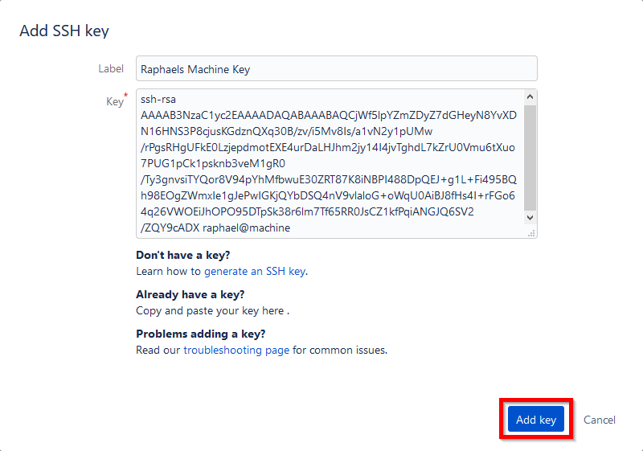

# **How To Git**
## Use git like a pro!

Raphael Guntersweiler
<raphael@guntersweiler.net>

---

# What you're learning today:
- Password-less authentication
- Command line basics
- Alternatives to Sourcetree

---

<!-- _class: invert -->


# Password-less authentication
How to authenticate without a password?

---

## Benefits
- no need for domain password
- blocked domain account doesn't block you from working

---

## How to setup
0. Open your Git Bash
1. Generate your SSH key

```
$ ssh-keygen

Generating public/private rsa key pair.
Enter file in which to save the key (/home/raphael/.ssh/id_rsa):
Enter passphrase (empty for no passphrase):
Enter same passphrase again:
Your identification has been saved in /home/raphael/.ssh/id_rsa.
Your public key has been saved in /home/raphael/.ssh/id_rsa.pub.
The key fingerprint is:
SHA256:0123456789abcdefghijklmnopqrstuvwxyz+-/0123 raphael@machine
The key's randomart image is:
+---[RSA 2048]----+
|                 |
|                 |
|                 |
|                 |
+----[SHA256]-----+
```

---

2. Print and copy your SSH **Public Key**

```
$ cat ~/.ssh/id_rsa.pub

ssh-rsa AAAAB3NzaC1yc2EAAAADAQABAAABAQCjWf5lpYZmZDyZ7dGHeyN8YvXDN16HNS3P8cjusKGd
znQXq30B/zv/i5Mv8Is/a1vN2y1pUMw/rPgsRHgUFkE0LzjepdmotEXE4urDaLHJhm2jy14I4jvTghdL
7kZrU0Vmu6tXuo7PUG1pCk1psknb3veM1gR0/Ty3gnvsiTYQor8V94pYhMfbwuE30ZRT87K8iNBPI488
DpQEJ+g1L+Fi495BQh98EOgZWmxIe1gJePwIGKjQYbDSQ4nV9vlaloG+oWqU0AiBJ8fHs4I+rFGo64q2
6VWOEiJhOPO95DTpSk38r6lm7Tf65RR0JsCZ1kfPqiANGJQ6SV2/ZQY9cADX raphael@machine
```

---

3. Open your Bitbucket profile and add your SSH public key.

 

---

4. Change your existing repositories _remote_ to SSH.

```bash
$ git remote set-url origin <SSH URL>
```

5. Test your change

```bash
$ git pull

Already up to date.
```

---

<!-- _class: invert -->


# Command Line Basics

_yes, I know the stock image shows HTML code_

---

## Simple Bash Basics
### Navigation and file system
Change directory
```bash
$ cd <dir>
```

List files
```bash
$ ls
# or with more details
$ ls -la
```

Create directory
```bash
mkdir <dirname>
```

---

### Print file content
Print complete file content
```bash
$ cat <file>
# or with paging support
$ less <file>
```

Print first / last 10 lines of a file
```bash
$ head <file>
$ tail <file>
```

---

### Modifying file system
Create an empty file
```bash
$ touch <file>
```

Copy file
```bash
$ cp <file> <newFile>
```

Rename / move file
```bash
$ mv <oldFile> <newFile>
```

Delete file (_**Note: no Recycle Bin here!**_)
```bash
$ rm <file>
$ rm -rf <directory>
```

---

### Terminal Interaction
Clear console output
```bash
$ clear
```

Edit a file in the terminal
```bash
$ nano <file>
# or if you feel brave (or have no other choice)
$ vi <file>
```

_Helpful hint for `vi`/`vim`: You leave the editor by typing `:q!`_

---

## Clone a repository
```bash
$ git clone <Repo URL>

Cloning into 'my-cool-repo'...
remote: Enumerating objects: 12, done.
remote: Total 12 (delta 0), reused 0 (delta 0)
Receiving objects: 100% (12/12), done.
```

---

## Create changes
Add a file
```bash
$ git add file.txt
```

Stage a file for commit
```bash
$ git stage file.txt
```

Commit staged files
```bash
$ git commit -m "Your Commit Message"
```

---

## Check your repos status
```bash
$ git status

On branch master
Changes to be committed:
  (use "git restore --staged <file>..." to unstage)
        modified:   file.txt
```

"Unstage" a file
```bash
$ git reset file.txt
```

---

## Sync your changes
Push your changes
```bash
$ git push
```

Pull changes from _remote_
```bash
$ git pull
```

Fetch changes (without downloading them)
```bash
$ git fetch
```

---

## Reset all changes
Deletes all local changes and returns to the last commit
```bash
$ git reset --hard HEAD
```

List all files to be cleaned
```bash
$ git clean -d -n -X
```

Actually clean the files
```bash
$ git clean -d -f -X
```

---

## Branches
List all branches
```bash
$ git branch
```

Create and check out an existing branch
```bash
$ git checkout -b <branch>
```

Check out an existing branch
```bash
$ git checkout <branch>
```

Check out a remote branch
```bash
$ git checkout -b <branch> <remote>/<branch>
# e.g.
$ git checkout -b my-branch origin/my-branch
```

---

<!-- _class: invert -->


# Alternative GUI Clients

Because command lines can get exhausting at times

---

## Git GUI (_Windows, Mac, Linux_)


### Pro
- Simple
- Already integrated with Git installation

### Con
- Visually clunky
- Doesn't "hold your hand" at all (=> everything is DIY)

---

## GitKraken (_Windows, Mac, Linux_)


### Pro
- Modern looking
- Supports multiple repositories (tabs)
- Installs into User profile (no admin required)

### Con
- Free edition not permitted for commercial use
- Use requires a GitKraken account

---

## Fork (_Windows, Mac_)


### Pro
- Clean and simple structure
- Quick Launch (_type your action_)
- Also installs into User profile
- Issue tracker link (e.g. JIRA tickets)
- **Free!**

### Con
- _honestly, I couldn't come up with anything (yet)_

---

## More clients?

https://git-scm.com/downloads/guis/

_or ask your local search engine of choice_

---

<!-- _class: invert -->


# And don't forget your **IDE**!

---

## VS Code


- Integration works great for the normal workflow
- If you use VS Code to do your work, use it!

- _Note: Most commands are best issued through the command palette (`F1`)_

---

## Visual Studio


- Integration (called "_Team Explorer_") is simple and works well enough for most tasks
- VS2017 works well, VS2019 finally supports stashing
- Conflict resolution is excellent

---

## Rider (_IntelliJ IDEA_)


- Line-wise commiting
- Change lists (put your changes into a "playlist")
- Conflict resolution is also excellent
- If you use Rider (_or any Jetbrains IDE_), use it!

---

<!-- _class: invert -->

# Any questions?


---

<!-- _class: invert -->

# Thank you for your attention!

Raphael Guntersweiler
raphael@guntersweiler.net
